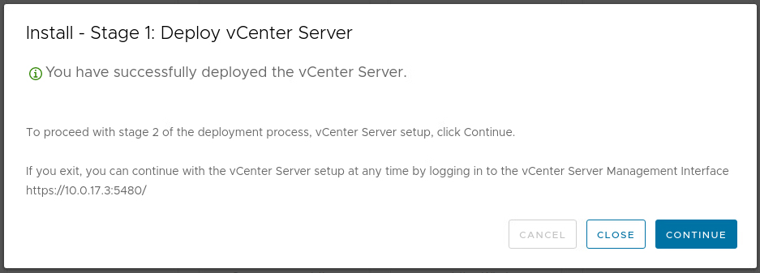

# vCenter

xubuntu-wan > edit settings > change CD/ROM from Host Device to ISO and select VCSA file > xubuntu auto mounted it


Terminal

```
cd /media/fatima/VMware\  VCSA/vcsa-ui-installer/lin64
./installer

# A popup comes up and most will be defaulted, checked thin disk provision
```

<figure><figcaption><p>Stage 1 Install Complete</p></figcaption></figure>

<figure><figcaption><p>This is the second install, this was one of the only changes from default</p></figcaption></figure>

<figure><figcaption><p>Stage 2 Install Complete</p></figcaption></figure>

Click the blue link: https://vcenter.fatima.local:443, sign in with administrator@vsphere.local and password. From there you right-click vcenter.fatima.local > New datacenter > Create datacenter > Right Click new data center > New Host > Fill in information
